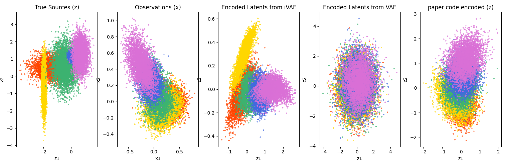
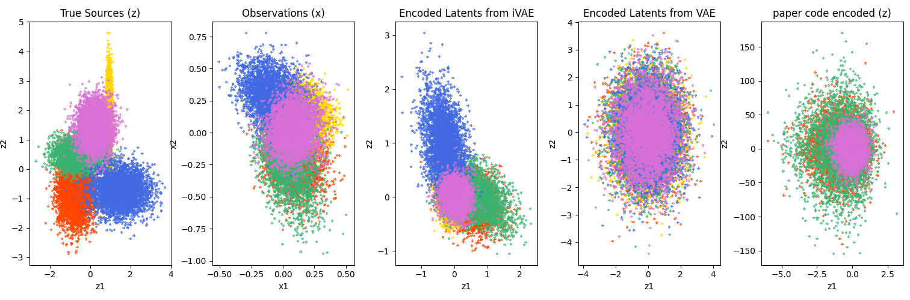
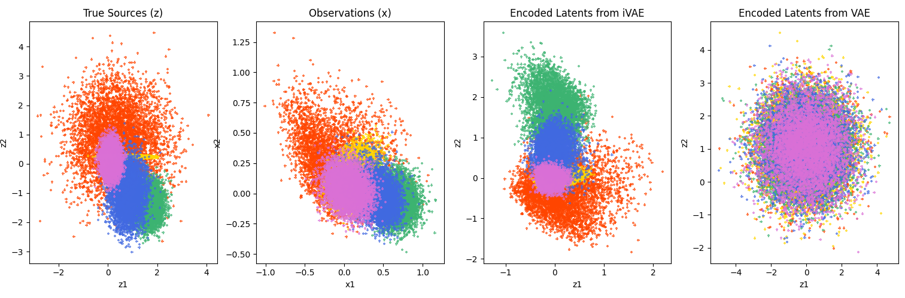
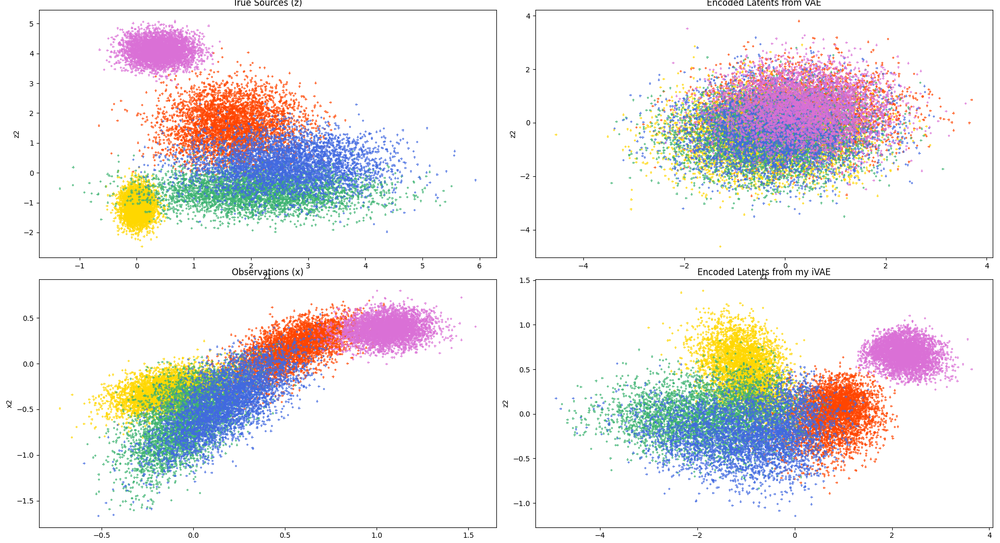

# CausalRepLearning
Code for CS 512 project
-----------------------
myModels.py contains my iVAE code
Models.py contains the iVAE offical code

Considering you already have installed the necessary packages.
For seeing the experiment store all the files in a directory and run the expiremnt file.

